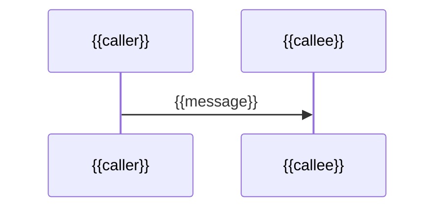

# Flows: {{KEY or name}}

## Current flow

```mermaid
flowchart TD
  A[{{entry point}}] --> B[{{step}}]
```

Walk-through:

1. `{{Class.method}}` - {{what happens}}

## Proposed flow

```mermaid
flowchart TD
  A[{{entry point}}] --> B[{{changed step}}]
```

What differs from the current flow: {{list; mark new or changed nodes}}

## Interaction between repositories / components (optional)



## States or data model (optional)

{{diagram or "not applicable"}}
